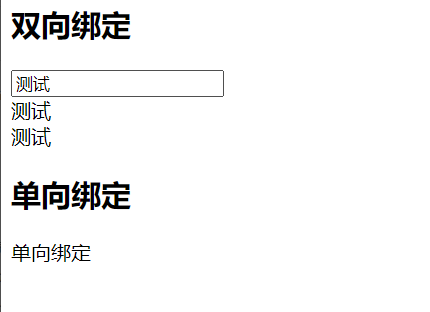
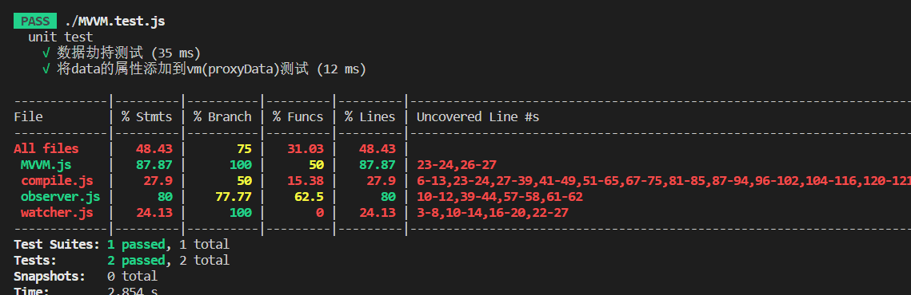

# MVVM实现

## 作者

**南京大学 陈凯文 201250198**

## 界面介绍



```html
<!DOCTYPE html>
<html lang="en">
<head>
    <meta charset="UTF-8">
    <title>Title</title>
</head>
<body>


<div id="app">
    <h2>双向绑定</h2>
    <input id="inputText" type="text" v-model="message.a">
    <div>{{message.a}}</div>
    {{message.a}}
    <br>
    <h2>单向绑定</h2>
    {{message.b}}
</div>

    <script src="MVVM.js"></script>
    <script src="compile.js"></script>
    <script src="observer.js"></script>
    <script src="watcher.js"></script>
<script>
    let vm =new MVVM({
        el:"#app",
        data:{
            message:{
                a:'双向绑定',
                b:'单向绑定'
            }
        }
    })
</script>
</body>
</html>
```

## 要求1：实现数据劫持

- 理解：当我们访问或设置对象的属性的时候，都会触发相对应的函数，然后在这个函数里返回或设置属性的值。既然如此，我们当然可以在触发函数的时候动一些手脚做点我们自己想做的事情，这也就是“劫持”操作。在Vue中其实就是通过Object.defineProperty来劫持对象属性的setter和getter操作，并“种下”一个监听器，当数据发生变化的时候发出通知。

- 实现：定义了Observer类，对id为“app”的元素中的数据均定义get和set方法，如下：

```javascript
class Observer{
    constructor(data) {
        this.observe(data)
    }
    observe(data){
    //    对data数据，原有的属性均改成get和set的形式
        if (!data || typeof data !== 'object') {
            return
        }
    //    对数据一一劫持 先获取到data的key和value
        Object.keys(data).forEach(key=>{
        //    劫持
            this.defineReactive(data,key,data[key])
            // 递归劫持
            this.observe(data[key])
        })

    }
//    定义响应式
    defineReactive(obj,key,value){
        let that=this
        let dep = new Dep()//每个变化的数据都会对应一个数组中的一个数据，这个数组存放所有更新的操作
        Object.defineProperty(obj,key,{
            enumerable:true,
            configurable:true,
            get(){//获取值时候的调用的方法
                Dep.target && dep.addSub(Dep.target)
                return value
            },
            set(newValue) {//给data属性中设置值的时候，更改获取到属性的值
                if (newValue !== value) {
                    that.observe(newValue)
                    value = newValue
                    dep.notify()//通知所有人，数据已经更新了
                }
            }
        })

    }
}
```

## 要求2：实现数据单向/双向绑定

- 理解：把Model绑定到View，当我们用JavaScript代码更新Model时，View就会自动更新。

- 实现：获取el节点，之后提取想要的元素节点 v-model 和 文本节点{{}} 

```js

class Compile{
    constructor(el,vm) {
        //el可能就是dom节点，也有可能需要自己获取
        this.el = this.isElementNode(el) ? el : document.querySelector(el);
        this.vm=vm
        if(this.el){
        //    如果el节点能够获取到，我们才能开始编译
        //    步骤:1.先将真实DOM移入内存（fragment）中，比频繁操作DOM快
            let fragment=this.node2fragment(this.el)
        //    2.编译-》提取想要的元素节点 v-model 和 文本节点{{}}  提取之后需要替换
            this.compile(fragment)
        //    3.把编译好的fragment放回页面中
            this.el.appendChild(fragment)
        }
    }
//    辅助方法
//    判断这里的节点是dom节点还是字符
    isElementNode(node){
        return node.nodeType === 1;
    }
    isDirective(name){
        return name.includes('v-')
    }

//    核心方法
    node2fragment(el){//将el节点中的内容全部放在内存中去
        let fragment = document.createDocumentFragment();
        let firstChild;
        while (firstChild = el.firstChild) {
            fragment.appendChild(firstChild)
        }
        return fragment //将节点放在内存中了，如果不放回页面的话，页面会为空
    }

    compile(fragment){
    //    需要递归才能拿到父节点以及所有的子节点
        let childNodes = fragment.childNodes;
        Array.from(childNodes).forEach(node=>{
            if(this.isElementNode(node)){
            //    dom节点--可能是父节点，内存仍然有子节点，此时还需要深入递归
            //    编译元素
            this.compileElement(node);

            //  箭头函数没有this对象，所以这里的this始终指向Compile的实例

                this.compile(node)

            }
            else {
            //    文本
            //    编译文本
            this.compileText(node)
            }
            }
        )
    }

    compileElement(node){
    //    取节点中的属性，得到v-model
        let attrs=node.attributes
        Array.from(attrs).forEach(attr=>{
        //    判断属性名称是否包含v-
            if(this.isDirective(attr.name)){
            //    取到vm中data对应的值，放在该节点（node）中 做替换
                let expr = attr.value;
            //    v-model v-text v-html 有多个v-指令type
                let [,type] = attr.name.split('-')
                this.CompileUtil[type](node, this.vm, expr);
            }

        })
    }

    compileText(node) {
        let expr = node.textContent
        //取{{}}中字符的内容
        let reg = /\{\{([^}]+)\}\}/g
        if(reg.test(expr)){
           this.CompileUtil['text'](node, this.vm, expr);
        }
    }

    CompileUtil={
        getVal(vm,expr){
            expr = expr.split('.') //处理 message.a.b.c这样的expr
            return expr.reduce((prev,next)=>{
                return prev[next]  //第一次就是 vm.$data.a
            },vm.$data)
        },
        getTextVal(vm,expr){ //获取编译文本之后的结果
            return  expr.replace(/\{\{([^}]+)\}\}/g,(...argument)=>{
                return this.getVal(vm,argument[1])
            })
        },
        text(node, vm, expr) {//文本处理
            let updateFn = this.updater['textUpdater'];
            let value=this.getTextVal(vm,expr)
            //R expr的形式可能是{{a}}{{b}}
            expr.replace(/\{\{([^}]+)\}\}/g,(...argument)=>{
                new Watcher(vm,argument[1],()=>{
                    //如果数据变化了，文本节点需要重新获取依赖的属性，更新文本中的内容
                    updateFn && updateFn(node,this.getTextVal(vm,expr))
                })
            })
            updateFn && updateFn(node,value)
        },
        setVal(vm, expr, newVal) {
            expr = expr.split('.')
            return expr.reduce((prev,next,currentIndex)=>{
                if (currentIndex === expr.length - 1) {
                    return prev[next] = newVal
                }
                return prev[next]
            },vm.$data)
        },
        model(node,vm,expr){//输入框处理
            let updateFn = this.updater['modelUpdater'];
            //这里有一个监控 当数据变化了 有关调用这个watch的callback函数
            new Watcher(vm,expr,(newValue)=>{
                //值变化后会调用cb，将新值传递过来
                updateFn && updateFn(node,this.getVal(vm,expr))
            })
            node.addEventListener('input', (e) => {
                let newValue = e.target.value
                this.setVal(vm,expr,newValue)
            });
            updateFn && updateFn(node,this.getVal(vm,expr))
        }
        ,
        updater: {
            //文本更新
            textUpdater(node,value) {
                node.textContent = value;
            },
            //输入框更新
            modelUpdater(node,value){
                node.value = value;
            }
        }
    }

}

module.exports={Compile}
```

## 要求3：实现发布订阅模式

- 理解：发布-订阅模式其实是一种对象间一对多的依赖关系，当一个对象的状态发送改变时，所有依赖于它的对象都将得到状态改变的通知。订阅者（Subscriber）把自己想订阅的事件注册（Subscribe）到调度中心（Event Channel），当发布者（Publisher）发布该事件（Publish Event）到调度中心，也就是该事件触发时，由调度中心统一调度（Fire Event）订阅者注册到调度中心的处理代码。

- 实现:

```js
//发布订阅的实现
class Dep{
    constructor() {
        //订阅的数组
        this.subs=[]
    }
    addSub(watcher){
        this.subs.push(watcher)
    }
    notify(){
        this.subs.forEach(watcher=>{
            watcher.update()
        })
    }
}

```

## 要求4：单元测试

```javascript
import Watcher from "../watcher";
import Observer from "../observer";
import Compile from "../compile";
import MVVM from "../MVVM";
import 'whatwg-fetch'
import $ from "jquery"
import {re} from "@babel/core/lib/vendor/import-meta-resolve";

const fs = require('fs');
const path = require('path');
const html = fs.readFileSync(path.resolve('D:\\CODE\\MVVM', './MVVM.html'), 'utf8');
jest.dontMock('fs');

let options={}


describe('$', function () {
    beforeEach(() => {
        document.documentElement.innerHTML = html.toString();
        options={
            el:"#app",
            data:{
                message:{
                    a:'hello'
                }
            }
        }

    });
    afterEach(jest.resetModules);
    test('observer,测试数据劫持' , function (done) {
        let observer=new Observer(options.data)
        expect(options.data.message).hasOwnProperty('get')
        expect(options.data.message).hasOwnProperty('set')
        done()
    })

    test('将data的属性添加到vm(proxyData)测试' , ()=>{
        let vm = new MVVM(options);
        expect(vm.hasOwnProperty('message')).toBe(true);
    });


});
```


